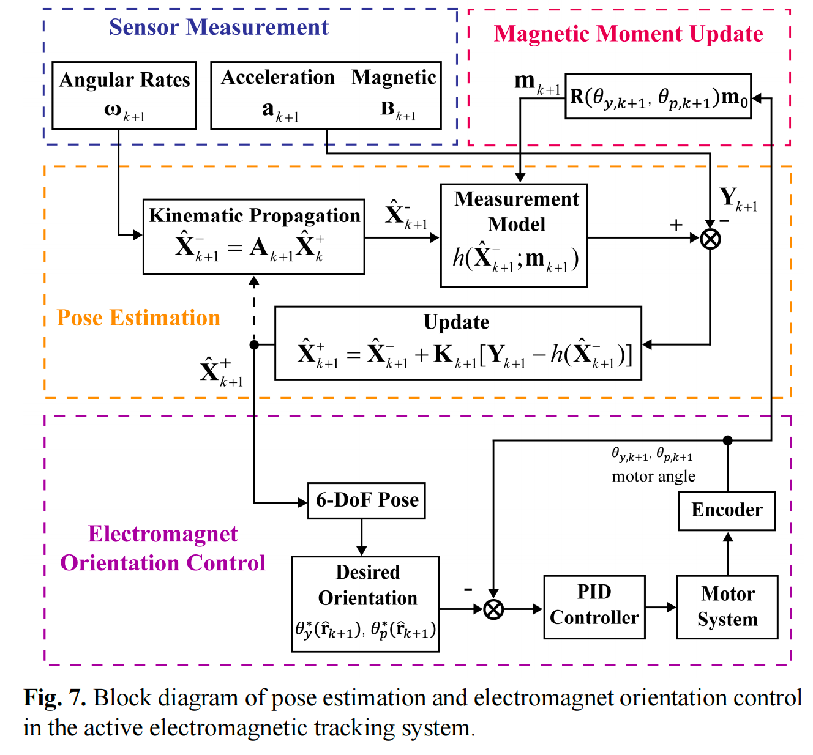
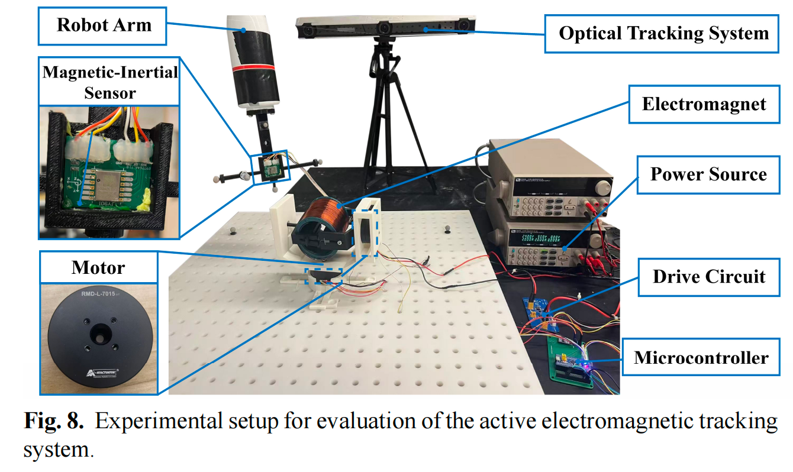

### **主动电次定位系统**  
**2024年4月 – 2025年2月 | 华南理工大学**  
理论解析了单磁源系统的定位精度空间分布，构建了磁灵敏度与定位精度的关系。通过两周云台结构旋转磁源，构建主动电磁定位系统，实现周向的高精度定位。
<table align="center">
  <tr>
    <td align="center">
      
    </td>
    <td align="center">
      
    </td>
  </tr>
</table>

  
  

#### 主要贡献:  
- 主动电次定位系统的搭建与实验
- 论文撰写与绘图

    <h4>Active Magnetic Tracking Demo</h4>
    <iframe width="720" height="405"
        src="https://www.youtube.com/embed/JWo8pzJ2kVc"
        frameborder="0"
        allow="accelerometer; autoplay; clipboard-write; encrypted-media; gyroscope; picture-in-picture"
        allowfullscreen>
    </iframe>

<a href="https://www.youtube.com/embed/JWo8pzJ2kVc" target="_blank">如果视频无法播放，请点击这里</a>

### **具身智能**  
**2025年1月 – 2025年6月 | 上海交通大学IRMV实验室**  

负责大规模推荐系统的开发与优化，专注于算法改进和系统效率提升。参与实时数据处理管道的构建，并优化模型推理流程，以提升个性化内容推荐效果。

#### 主要贡献:  
- 研发并优化推荐算法，提高用户互动率和内容相关性。  
- 设计并实现实时数据处理流程，提升模型推理的计算效率。  
- 进行A/B测试与性能分析，基于用户行为数据优化推荐策略。
